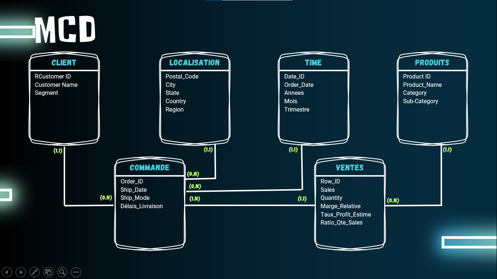
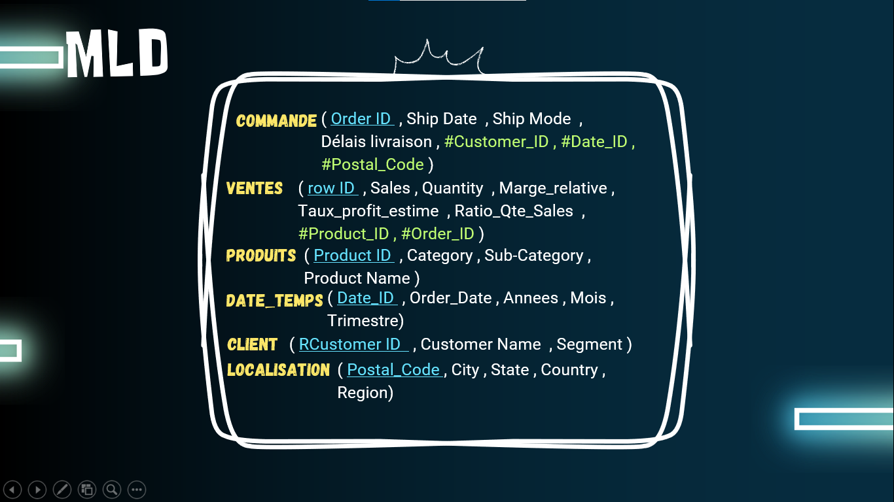
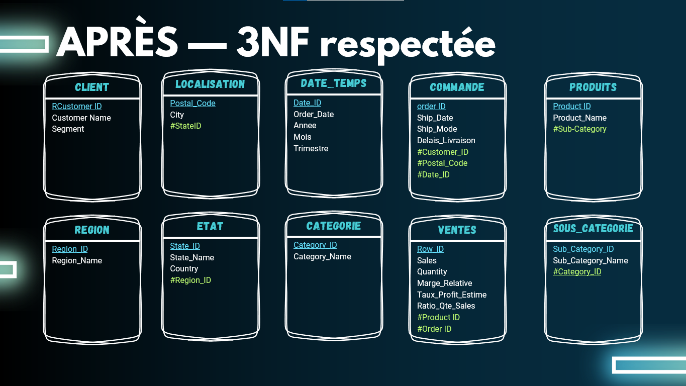

# 📊 Superstore Sales: ETL, Analysis & PostgreSQL Integration

[](https://www.python.org/)
[](https://www.postgresql.org/)
[]()

Ce projet fournit une solution **Enterprise-Ready** pour automatiser l'intégralité du cycle de vie des données de ventes du dataset **Superstore**. Il transforme un fichier CSV plat en une base de données relationnelle normalisée (3NF) et génère des rapports d'analyse décisionnelle professionnels.

---

## 📁 Architecture Modulaire

Le projet est organisé selon les meilleures pratiques de développement Python pour garantir la maintenabilité et la clarté.

```text
📦 Superstore-Project
├── 🚀 main.py                     # Orchestrateur du pipeline (Nettoyage -> Visualisation -> Rapport)
├── 📂 src/                        # Code source du projet
│   ├── 📂 cleaning/               # Moteur d'ETL
│   │   ├── 🛠️ read_clean_data.py  # Logique principale de nettoyage et transformation
│   │   └── 🔧 fun.py              # Utilitaires de typage et formatage de données
│   ├── 📂 visual/                 # Analytique Visuelle
│   │   └── 📈 graphes.py          # Génération automatisée de graphiques Matplotlib
│   ├── 📂 reporting/              # Business Intelligence
│   │   └── 📄 rapport.py          # Moteur de génération de rapports Word (.docx)
│   └── 📂 database/               # Couche de Persistance
│       ├── 🚀 db_main.py          # Script d'orchestration de la base de données
│       ├── 🏗️ create_tables.py    # Définition du schéma SQL avec SQLAlchemy
│       ├── ✂️ split_csv.py        # Logique de normalisation (Flat CSV -> Relational)
│       ├── 🔍 check_uniqueness.py # Validation d'intégrité référentielle
│       ├── 🔗 db_connection.py    # Gestionnaire de connexion SQLAlchemy
│       └── ⚙️ config.py           # Chargement sécurisé de la configuration (.env)
├── 📂 data/                       # Stockage des données
│   ├── 📥 raw/                    # Données sources non transformées
│   ├── 📤 processed/              # Résultats du nettoyage et graphiques
│   └── 🛠️ sql_splits/             # CSV normalisés prêts pour l'insertion SQL
├── 📂 docs/                       # Patrimoine documentaire
│   ├── 📊 presentations/          # Supports de présentation PPTX
│   ├── 🖼️ img/                     # Diagrammes Merise (MCD, MLD, 3NF)
│   └── 📄 reports/                # Archives des rapports BI générés
├── 🧪 tests/                      # Suite de tests (Intégrité & Analytics)
├── 📄 .env                        # Secrets et configuration locale (Ignoré par Git)
├── 📄 requirements.txt            # Liste exhaustive des dépendances
└── 📄 README.md                   # Documentation maîtresse
```

---

## 🏗️ Modélisation de la Donnée (Méthode Merise)

Le passage d'un format plat à un format relationnel est basé sur une modélisation rigoureuse assurant l'intégrité des données.

### 🧩 Modèle Conceptuel (MCD)
*Définition des entités métier et de leurs relations.*


### 📐 Modèle Logique (MLD)
*Traduction technique vers un système relationnel.*


### 💎 Modèle Physique & Normalisation (3NF)
*Optimisation pour éviter la redondance et assurer la cohérence.*


---

## ⚙️ Déploiement & Configuration

### 1. Préparation de l'environnement
Clonage et installation des dépendances nécessaires :
```bash
pip install -r requirements.txt
```

### 2. Sécurisation des accès
Configurez vos identifiants PostgreSQL dans le fichier `.env` à la racine :
```ini
DB_USER=votre_utilisateur
DB_PASSWORD=votre_mot_de_passe
DB_HOST=localhost
DB_PORT=5432
DB_NAME=superstore_db
```

---

## 🚀 Workflows d'Exécution

### 🔄 Étape 1 : Pipeline ETL & BI
Traite les données brutes, calcule les KPIs (marges, délais, croissances) et génère le rapport Word final.
```bash
python main.py
```
> **Résultat :** Les données nettoyées sont dans `data/processed/` et le rapport dans `docs/reports/`.

### 🗄️ Étape 2 : Migration Data Warehouse
Normalise le CSV processed et injecte les données dans PostgreSQL selon le schéma 3NF.
```bash
python -m src.database.db_main
```
> **Processus :** Création des tables -> Split relationnel -> Validation d'unicité -> Insertion massive.

---

## 🛠️ Stack Technique & Bibliothèques
| Domaine | Outil | Usage |
| :--- | :--- | :--- |
| **Langage** | Python 3.x | Logiciel socle |
| **ETL** | Pandas | Manipulation et nettoyage de données complexes |
| **ORM** | SQLAlchemy | Abstraction et gestion du schéma de base de données |
| **Reporting** | Python-docx | Automatisation de documents institutionnels |
| **Visualisation** | Matplotlib | Création de tableaux de bord graphiques |
| **Secrets** | Python-dotenv | Gestion sécurisée des variables d'environnement |

---

## 📧 Contact
- **Lead Developer :** Soubi Charaf
- **Organisation :** Simplon Data Project.